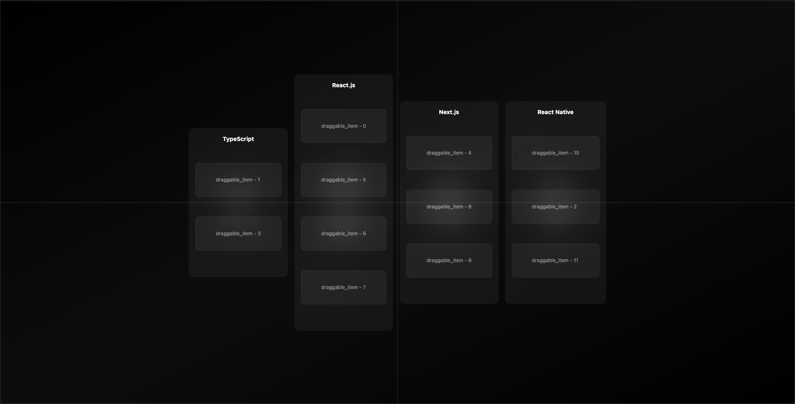

# 프론트엔드 개발 과제

이 프로젝트는 Webpack 설정을 직접 구성하고, 주어진 요구사항에 따라 동작하는 드래그 앤 드롭 기능을 구현하는 과제입니다.

## 과제 목표

- **Webpack 적용**: `react-scripts`를 사용하지 않고, Webpack을 직접 설정하여 React 애플리케이션을 구성합니다.
- **칼럼 확장**: 기존의 한 칼럼에서 네 개의 칼럼으로 확장합니다.
- **드래그 제약 조건 적용**: 특정 규칙에 따라 아이템의 드래그를 제한합니다.
- **멀티 드래그 기능 구현**: 여러 아이템을 동시에 선택하고 드래그하는 기능을 추가합니다.


## 실행 방법

1. **레포지토리 클론**

   ```bash
   git clone https://github.com/kysclient/react-tailwind-dnd.git
   cd front_assignment
   ```

2. **필요한 패키지 설치**

   ```bash
   npm install
   ```

3. **애플리케이션 실행**

   ```bash
   npm start
   ```

4. **웹 브라우저에서 확인**
   ```bash
   http://localhost:AUTO //터미널 참고
   ```

이제 로컬 서버에서 실행됩니다. 브라우저를 통해 확인할 수 있습니다.
